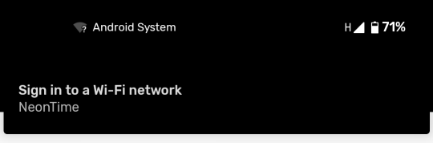
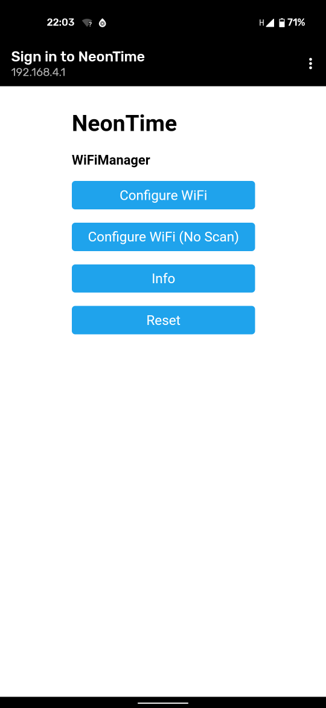
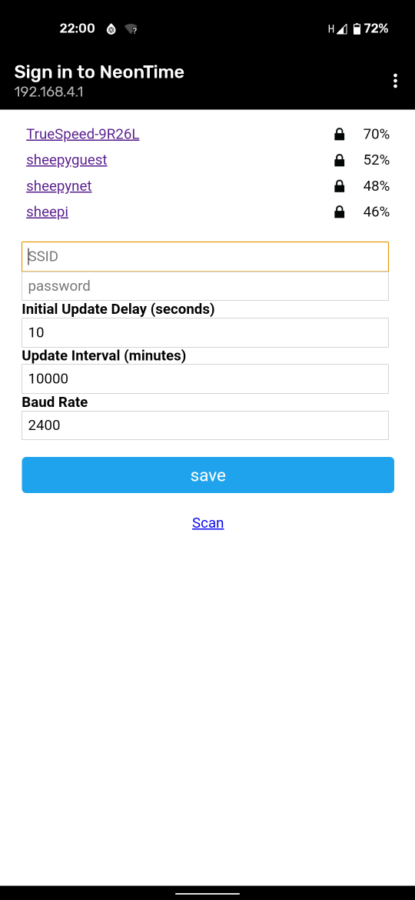
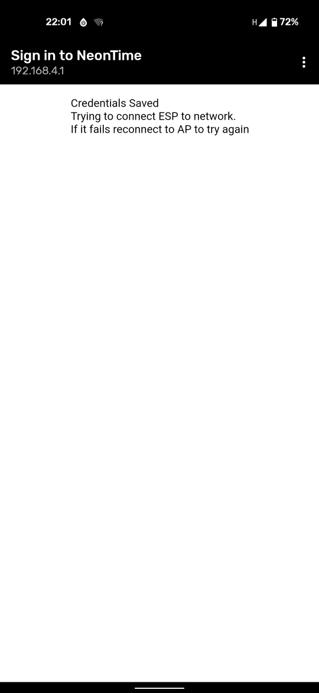

# NeonTime Sync

## Usage

### Connecting

* Disconnect the clock from its power source
* Connect NeonTime Sync to the clock using a 3.5mm stereo jack
* Connect the clock back to its power source

### First Usage

The first time you connect NeonTime Sync it will need to be configured with
your WiFi credentials.

To do this first confirm that NeonTime Sync is connected and that the blue LED is remains on. If the LED turns off after ~5 seconds then refer to the section on "Entering Configuration Mode" below.

### Manually Entering Configuration Mode

* Press and release the button on the side of the NeonTime Sync
* Wait ~5 seconds, then press and release again
* If the blue LED remains on after 10s then it is in configuration mode

### Configuring

You can use either a laptop, phone or tablet for this.

Connect to the WiFi network called "NeonTime", no password is required.
Once your device is connected you may be prompted to "Sign in"

Follow this prompt or open a browser and navigate to http://192.168.4.1

Select the "Configure WiFi" option to be presented with this screen

If your SSID appears in the list then click it and it will pre-fill the SSID box. Enter your password then click "save".

It should present you with the following screen and the NeonTime Sync will reboot and connect to your WiFi network.

