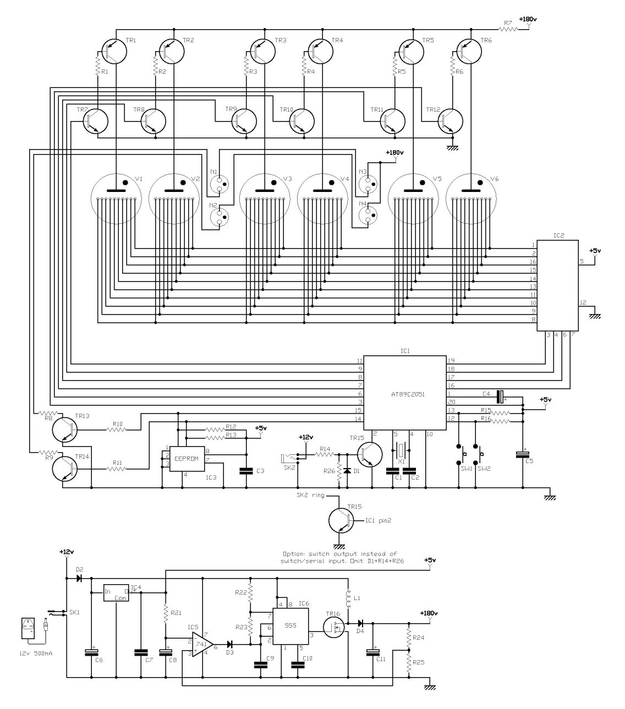
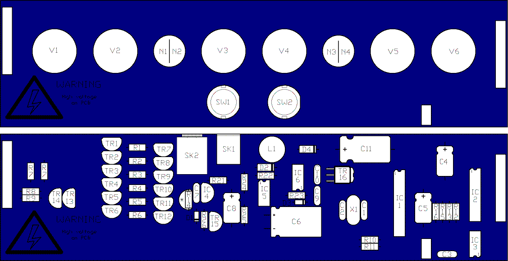

# Schematic

# Parts

|                     |                                         |              |                                         |
| ------------------- | --------------------------------------- | ------------ | --------------------------------------- |
| R1 - R6, R21, R24   | 390k                                    | IC1          | 89S2051 programmed with 2D3 firmware    |
| R7                  | 2 x 8K2 in parallel                     | IC2          | K155ID1 (74141)                         |
| R8 - R11            | 82K                                     | IC3          | 24LC00\*\* or DS1307\*\*\*              |
| R12, R13, R15, R16  | 4K7                                     | IC4          | 78L05                                   |
| R14\*, R26\*        | 10K                                     | IC5          | 741                                     |
| R22                 | 1K8                                     | IC6          | 555                                     |
| R23                 | 560R                                    |              |                                         |
| R25                 | 11K                                     | D1\*, D3     | 1N4148                                  |
| C1, C2              | 33pF                                    | D4           | BA157                                   |
| C3, C7, C10         | 100nF                                   |              |                                         |
| C4, C5, C8          | 1uF axial                               | TR1 - TR6    | MPSA92                                  |
| C6                  | 470uF 25V radial                        | TR7 - TR14   | MPSA42                                  |
| C9                  | 4n7                                     | TR15\*       | BC548                                   |
| C11                 | 2u2 250V axial                          | TR16         | STD2NC45-1                              |
| L1                  | 220uH (ELC08D221E)                      | V1 - V6      | IN-14 Nixie tube                        |
| X1                  | 6Mhz 20ppm crystal (fit an insulator)   | N1 - N4      | neon lamp as required                   |
| X2 \*\*\*           | 32.768Khz watch crystal CL=12.5pF       |              |                                         |
| PSU                 | 12V 300mA (min) regulated 2.1mm plug    | SK1          | 2.1mm power                             |
|                     |                                         | SK2\*        | 3.5mm stereo jack                       |
| Battery \*\*\*      | CR1225 Lithium cell                     |              | Breakaway pin header (2x10 + 1x3 way)   |
| \*\*\*              | Surface mount holder for CR1225         |              | Breakaway SIL socket (2x10 + 1x3 way)   |

- \*    omit if the PC synchronisation option is not required.
- \*\*   not required if RTC option is fitted.
- \*\*\*  RTC option only

# Layout

